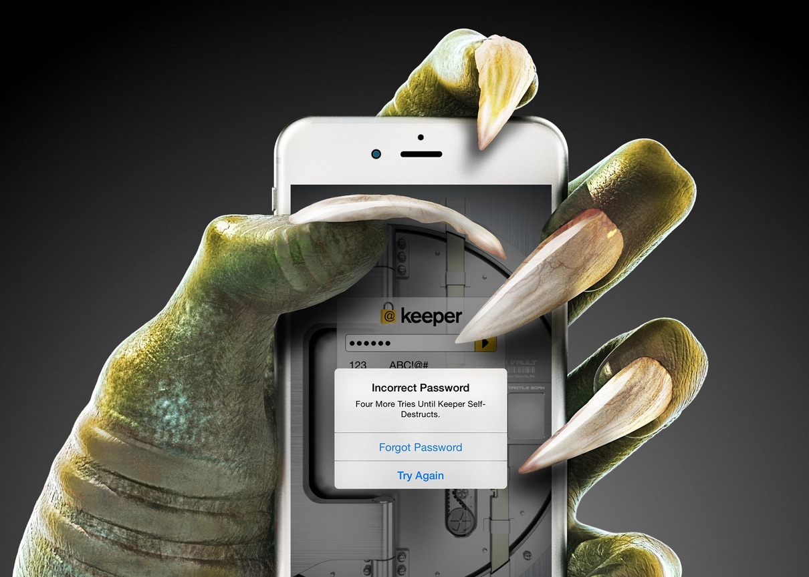

## Keeper Commander 

----
Commander is a command-line and SDK interface to *Keeper&reg; Password Manager &amp; Digital Vault*.  Keeper Commander can be used to interactively access your Keeper Vault via a standard terminal or SSH console, or it can be used as an SDK for integrating your back-end into Keeper's zero-knowledge Cloud Security Vault&trade;.

### Commander Features

* Terminal-based access to your Keeper vault 
* Login, download and decrypt your vault records  
* Search for content with regular expressions
* Display vault record details
* Change or rotate a password
* Push password resets to external systems (Active Directory, MySQL, etc...) 

### Installation  
To jump right in to Commander, simply download the [Python](https://github.com/Keeper-Security/commander/python) code and you'll be up and running in a few minutes.

### Support 
We're here to help.  If you need help integrating Keeper into your environment, contact us at ops@keepersecurity.com.

### Security

Keeper is a zero-knowledge platform.  This means that the server does not have access to your Keeper Master Password or the crypto keys used to encrypt and decrypt your data.  The cryptography is performed on the *client device* (e.g. iPhone, Android, Desktop, Commander).

When you create a Keeper account from our [web app](https://keepersecurity.com/vault) or [mobile/desktop app](https://keepersecurity.com/download), you are asked to create a master password and a security question.  The Keeper app creates your crypto keys, RSA keys and encryption parameters (iv, salt, iterations).  Your RSA private key is encrypted with your data key, and your data key is encrypted with your master password.  The encrypted version of your data key is stored in Keeper's Cloud Security Vault and provided to you after successful device authentication.

When you login to Keeper on any device (or on Commander), your master password is used to derive a 256-bit PBKDF2 key.  This key is used to decrypt your data key.  The data key is used to decrypt individual record keys.  Finally, your record keys are then used to decrypt your stored vault information (e.g. your Facebook password).

When saving information to your vault, Keeper stores only the encrypted data, which can only be decrypted on your client device.  

For added security, you can enable Two-Factor Authentication on your Keeper account via the [web app](https://keepersecurity.com/vault) settings scree.  When logging into Commander, you will be asked for a one time passcode.  After successful authentication, you will be provided with a device token to use for subsequent requests.

All of this cryptography is packaged and wrapped into a simple and easy-to-use interface.  Commander gives you the power to access, store and syncronize encrypted vault records with ease.

To learn about Keeper's security, certifications and implementation details, visit the [Security Disclosure](https://keepersecurity.com/security.html) page on our website.

### About Keeper

Keeper is the world's most downloaded password keeper and secure digital vault for protecting and managing your passwords and other secret information.  Millions of people and companies use Keeper to protect their most sensitive and private information.

Keeper's Features &amp; Benefits

* Manages all your passwords and secret info
* Protects you against hackers
* Encrypts everything in your vault 
* High-strength password generator
* Login to websites with one click
* Store private files, photos and videos
* Take private photos inside vault 
* Share records with other Keeper users
* Access on all your devices and computers
* Keeper DNA&trade; multi-factor authentication
* Login with Fingerprint or Touch ID
* Auto logout timer for theft prevention
* Unlimited backups
* Self-destruct protection
* Customizable fields
* Background themes
* Integrated Apple Watch App
* Instant syncing between devices
* AES-256 encryption
* Zero-Knowledge security architecture
* TRUSTe and SOC-2 Certified

Supported Platforms
* iOS, Android, Mac, Windows, Unix, Linux, Kindle
* Chrome, Safari, Firefox, Internet Explorer

### Keeper Website
[https://keepersecurity.com](https://keepersecurity.com)

### Pricing
Keeper is free for local password management on your device.  Premium subscription provides cloud-based features and premium device-specific features including Sync, Backup & Restore, Secure Sharing, File Storage and multi-device usage.  

### Mobile Apps

[iPhone, iPad, iPod] (https://itunes.apple.com/us/app/keeper-password-manager-digital/id287170072?mt=8)

[Android (Google Play)](https://play.google.com/store/apps/details?id=com.callpod.android_apps.keeper&hl=en)

[Kindle (Amazon App Store)](http://amzn.com/B00NUK3F6S)

[BlackBerry (OS10+)](http://appworld.blackberry.com/webstore/content/33358889/?countrycode=US&lang=en)

[Windows Phone (8+)](http://www.windowsphone.com/en-us/store/app/keeper/8d9e0020-9785-e011-986b-78e7d1fa76f8)

[Surface](http://apps.microsoft.com/windows/en-us/app/keeper/07fe8361-f512-4873-91a1-acd0cb4c851d)

### Desktop Apps (Mac, PC, Linux)

[Windows PC](https://s3.amazonaws.com/keepersecurity/en_US/static/apps/Keeper.exe)

[Mac](https://s3.amazonaws.com/keepersecurity/en_US/static/apps/KeeperDesktop.dmg)

[Linux](https://s3.amazonaws.com/keepersecurity/en_US/static/apps/KeeperDesktopLinux.zip)

[Mac App Store](https://keepersecurity.com/macreview)

[Windows Store](http://apps.microsoft.com/windows/en-us/app/keeper/07fe8361-f512-4873-91a1-acd0cb4c851d)

