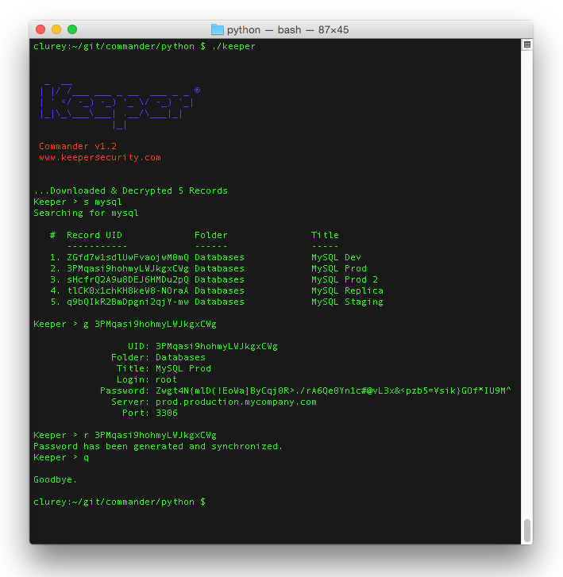

----
#### The Password Management SDK for IT Admins & Developers

Keeper Commander is a command-line and SDK interface to [Keeper&reg; Password Manager](https://keepersecurity.com).  Keeper Commander can be used to interactively access your Keeper Vault via a standard terminal or SSH console, or it can be used as an SDK for integrating your back-end into Keeper's zero-knowledge Cloud Security Vault&trade;.

Commander can securely rotate passwords in your Keeper vault and then automatically synchronize the change to all users with privileged access to the record.  Using our connector [plugins](https://github.com/Keeper-Security/commander/tree/master/src/plugins), you can then perform the password reset directly on the source (e.g. database, active directory, unix/pc login, etc...).  Using Commander to rotate passwords, combined with the flexibility of Keeper's secure record sharing features provides you with the most secure and flexible way to grant and revoke access to extremely confidential data.

[Here's a Video](https://youtu.be/p50OKRiaxl8) demonstrating Commander.

### Features

* Console access to your Keeper vault
* Login, download and decrypt your vault records
* Search for content with regular expressions
* Display vault record details
* Change logins, passwords and other record data
* Rotate passwords and push changes to connected platforms
* Control record and user permissions
* Automate everything

Keeper Commander provides deep integration of privileged password management into back-end systems to securely access credentials, elevate permissions and rotate passwords. With Keeper Commander you can automate key security features on any platform.

Changes made through Keeper Commander instantly propagate to the users who have access to that specific record.

When you grant and revoke access or rotate a password, it instantly updates to users on their mobile and desktop devices. Control access to highly secure systems by rotating passwords and pushing those credentials to users - all within the Keeper ecosystem.

### Installation  
Follow the instructions in the README within the src/ and src/plugins/ folder.

### Support 
We're here to help.  If you need help integrating Keeper into your environment, contact us at ops@keepersecurity.com.

### About Our Security

Keeper is a zero-knowledge platform.  This means that the server does not have access to your Keeper Master Password or the crypto keys used to encrypt and decrypt your data.  The cryptography is performed on the *client device* (e.g. iPhone, Android, Desktop, Commander).

When you create a Keeper account from our [web app](https://keepersecurity.com/vault) or [mobile/desktop app](https://keepersecurity.com/download), you are asked to create a Master Password and a security question.  The Keeper app creates your crypto keys, RSA keys and encryption parameters (iv, salt, iterations).  Your RSA private key is encrypted with your data key, and your data key is encrypted with your Master Password.  The encrypted version of your data key is stored in Keeper's Cloud Security Vault and provided to you after successful device authentication.

When you login to Keeper on any device (or on Commander), your Master Password is used to derive a 256-bit PBKDF2 key.  This key is used to decrypt your data key.  The data key is used to decrypt individual record keys.  Finally, your record keys are then used to decrypt your stored vault information (e.g. your MySQL password).

When storing information to your vault, Keeper stores and synchronizes the encrypted data.

For added security, you can enable Two-Factor Authentication on your Keeper account via the [web app](https://keepersecurity.com/vault) settings screen.  When logging into Commander with Two-Factor Authentication turned on, you will be asked for a one time passcode.  After successful authentication, you will be provided with a device token that can be used for subsequent requests without having to re-authenticate.

All of this cryptography is packaged and wrapped into a simple and easy-to-use interface.  Commander gives you the power to access, store and synchronize encrypted vault records with ease.

To learn about Keeper's security, certifications and implementation details, visit the [Security Disclosure](https://keepersecurity.com/security.html) page on our website.

### About Keeper

Keeper is the world's most downloaded password keeper and secure digital vault for protecting and managing your passwords and other secret information.  Millions of people and companies use Keeper to protect their most sensitive and private information.

Keeper's Features &amp; Benefits

* Manages all your passwords and secret info
* Protects you against hackers
* Encrypts everything in your vault 
* High-strength password generator
* Login to websites with one click
* Store private files, photos and videos
* Take private photos inside vault 
* Share records with other Keeper users
* Access on all your devices and computers
* Keeper DNA&trade; multi-factor authentication
* Login with Fingerprint or Touch ID
* Auto logout timer for theft prevention
* Unlimited backups
* Self-destruct protection
* Customizable fields
* Background themes
* Integrated Apple Watch App
* Instant syncing between devices
* AES-256 encryption
* Zero-Knowledge security architecture
* TRUSTe and SOC-2 Certified

### Keeper Website
[https://keepersecurity.com](https://keepersecurity.com)

### Pricing
Keeper is free for local password management on your device.  Premium subscription provides cloud-based features and premium device-specific features including Sync, Backup & Restore, Secure Sharing, File Storage and multi-device usage.  More info about our consumer and enterprise pricing plans can be found [here](https://keepersecurity.com/pricing.html). 

### Mobile Apps

[iPhone, iPad, iPod] (https://itunes.apple.com/us/app/keeper-password-manager-digital/id287170072?mt=8)

[Android (Google Play)](https://play.google.com/store/apps/details?id=com.callpod.android_apps.keeper&hl=en)

[Kindle (Amazon App Store)](http://amzn.com/B00NUK3F6S)

[BlackBerry (OS10+)](http://appworld.blackberry.com/webstore/content/33358889/?countrycode=US&lang=en)

[Windows Phone (8+)](http://www.windowsphone.com/en-us/store/app/keeper/8d9e0020-9785-e011-986b-78e7d1fa76f8)

[Surface](http://apps.microsoft.com/windows/en-us/app/keeper/07fe8361-f512-4873-91a1-acd0cb4c851d)

### Desktop Apps (Mac, PC, Linux)

[Windows PC](https://s3.amazonaws.com/keepersecurity/en_US/static/apps/Keeper.exe)

[Mac](https://s3.amazonaws.com/keepersecurity/en_US/static/apps/KeeperDesktop.dmg)

[Linux](https://s3.amazonaws.com/keepersecurity/en_US/static/apps/KeeperDesktopLinux.zip)

[Mac App Store](https://keepersecurity.com/macreview)

[Windows Store](http://apps.microsoft.com/windows/en-us/app/keeper/07fe8361-f512-4873-91a1-acd0cb4c851d)

### Web-Based Apps and Browser Extensions

[Online Vault](https://keepersecurity.com/vault)

[FastFill for Chrome](https://chrome.google.com/webstore/detail/keeper-browser-extension/bfogiafebfohielmmehodmfbbebbbpei)

[FastFill for Firefox](https://addons.mozilla.org/en-us/firefox/addon/keeper-password-manager-digita/)

[FastFill for Safari](https://s3.amazonaws.com/keepersecurity/ext/update/safari/keeper.safariextz)

[FastFill for Internet Explorer](https://s3.amazonaws.com/keepersecurity/en_US/static/apps/SetupKeeperIE.exe)

[Enterprise Admin Console](https://keepersecurity.com/console)

