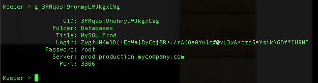

Keeper Commander for Python 3
----

This is the codebase for a Python 3 interface to Keeper.

Here's a preview of what Keeper Commander can do:

#### Logging in  


#### Listing available commands 


#### Searching for records


#### Getting record details 


#### Rotating a password 


The above screenshots are using the terminal version.  You can make the necessary hooks in the Commander source code to meet your integration needs.

### Installation

This type of installation assumes you want to view/modify the source code. Using the instructions below,
you will be able to have more than one copy of keeper commander installed without conflicting with each other.

1) Install Python3 from [python.org](https://www.python.org)

2) Install virtualenv:

```
sudo pip3 install virtualenv
```

3) Create and activate the virtual environment for your keeper project (you need to be in the keeper root folder):

```
virtualenv -p python3 venv
source venv/bin/activate
```

2) Install the required modules

```
pip install -r requirements.txt
```

3) Install the keeper package in development mode

```
pip install -e .
```

NOTE: Keeper Commander is only compatible with Python 3.4+

Keeper supports plugins for various 3rd party systems for password reset integration.  Depending on the plugin, you will need to install the modules required.  For example, to support our MySQL plugin:

```
pip3 install PyMySQL
```

3) Set up a Keeper account from https://keepersecurity.com if you don't already have one.

4) Execute command line program as described below or use a config.json file to streamline usage.  Command line arguments will override the configuration file.

### Command line usage

./keeper

### Optional parameters

./keeper --email=email@company.com 

### Auto-configuration file

To automate the use of Commander, create a file called config.json and place the file in your install folder.  If you don't provide a config file, Commander will just prompt you for the information.

Here's an example config.json file:

```
{                                                                               
    "server":"https://keeperapp.com/v2/",
    "email":"your_email_here",
    "password":"your_password_here",
    "debug":false,
    "commands":[]
}
```

You can also tell Commander which config file to use.  By default, we look at the config.json file.  Example:

./keeper --config=foo.json

In this case, Commander will start up using foo.json as the configuration.

### Auto-command execution

You can provide Commander a set of commands to run without having to type them manually.  This is the easiest way to automate password resets.

Example:

```
{                                                                               
    "debug":false,
    "server":"https://keeperapp.com/v2/",
    "email":"admin@company.com",
    "password":"somereallystrongpassword",
    "commands":["d", "r 3PMqasi9hohmyLWJkgxCWg", "r tlCK0x1chKH8keW8-NOraA"]
}
```

In this example, we are telling Commander to first download and decrypt records, then reset 2 passwords.  As you can see, each unique password record in the Keeper system is represented by a unique record UID.  Use the "l" or "s" command in Commander's interactive mode to display the record UIDs in your account.

### Two-Factor Authentication and Device Token

If you have Two-Factor Authentication enabled on your Keeper account (highly recommended), Keeper Commander will prompt you for the one-time passcode the first time you login.  After successfully logging in, you will be provided a device token. This device token needs to be saved for subsequent calls. Copy-paste this device token into your config.json file.  For example:

```
{                                                                               
    "debug":false,
    "server":"https://keeperapp.com/v2/",
    "email":"email@company.com",
    "password":"123456",
    "mfa_token":"vFcl44TdjQcgTVfCMlUw0O9DIw8mOg8fJypGOlS_Rw0WfXbCD9iw",
    "mfa_type":"device_token",
    "commands":["d", "r 3PMqasi9hohmyLWJkgxCWg", "r tlCK0x1chKH8keW8-NOraA"]
}
```

### Plugins

Keeper Commander can talk to external systems for the purpose of resetting a password and synchronizing the change inside the Keeper Vault.  For example, you might want to rotate your MySQL password and Active Directory password automatically.  To support a plugin, simply add a custom field to the record to specify which plugin Keeper Commander should use when changing passwords.  Example:

```
Name: cmdr:plugin
Value: mysql
```
```
Name: cmdr:plugin
Value: adpasswd
```

When a plugin is specified in a record, Commander will search in the plugins/ folder to load the module based on the name provided (e.g. mysql.py and active_directory.py).

Keeper's team is expanding the number of plugins on an ongoing basis. If you need a particular plugin created, just let us know.

### Commands

To see a list of supported commands, simply type '?':

```
Keeper > ?

Commands:

  d         ... download & decrypt data
  l         ... list folders and titles
  s <regex> ... search with regular expression
  g <uid>   ... get record details for uid
  r <uid>   ... rotate password for uid
  b <regex> ... rotate password for matches of regular expression
  a         ... add a new record interactively
  c         ... clear the screen
  h         ... show command history
  q         ... quit

```

* d (download): Downloads all records from the account, decrypts the data key, private key, decrypts records and shared folders. 

* l (list): Displays the Record UID, Folder and Title for all records.

* s (search): search across all record data and display the Record UID, Folder and Title for matching records.

* g (get): displays the full record details for a specified Record UID.  The Record UID can be determined by looking at the response from the "l" or "s" commands.

* r (rotate): rotates the password field of a specified Keeper record.  The new password generated is by default set to a very strong 64-byte ASCII-based string.  The previous password is also backed up and stored as a custom field in the record, saved with the timestamp of the change.

* b (batch rotate): search across all record data and rotate the password for matching records.

### Help 

If you need help, found a bug, or you're interesting in contributing, email us at ops@keepersecurity.com.