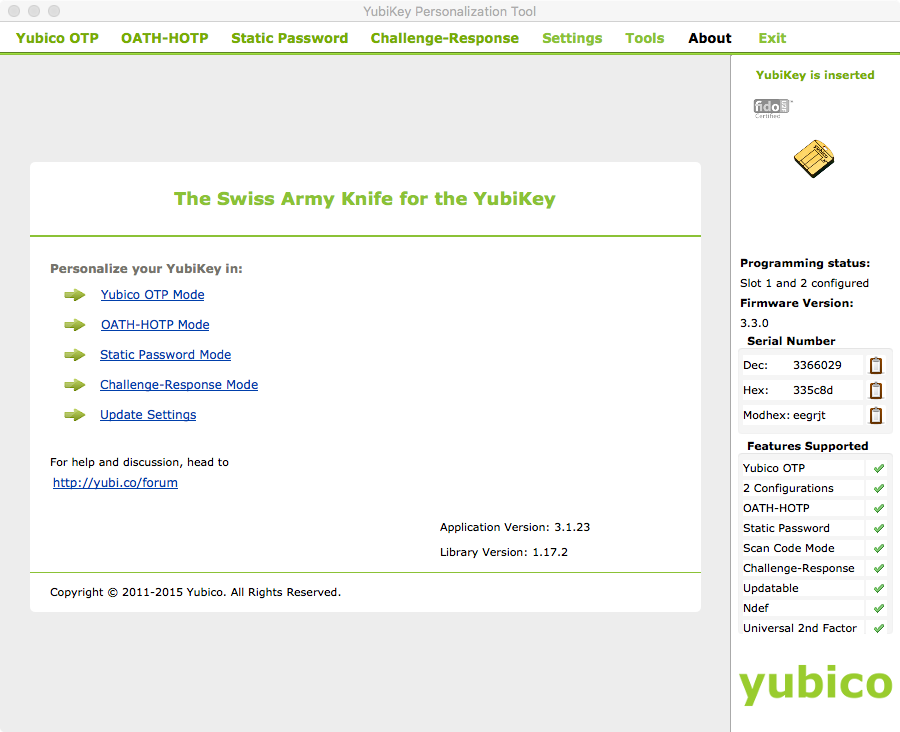

Yubikey Challenge-Response Module
----

Keeper Commander can be used along with YubiKey to provide better security for your Master Password. In this scenario, Yubikey is used in Challenge-Response mode to generate secure Master Password from non secure Challenge Phrase. You configure your Yubikey using the [Yubikey Personalization Tool](https://www.yubico.com/support/downloads/) as described below, and use the Yubikey output as your Master Password.

To use Keeper Commander in Scheduled Mode you can use Yubikey to initialize KEEPER_PASSWORD environment variable or include Challenge Phrase in your config.json file.
Note: **If using Commander in Scheduled Mode your master password resides in the memory of your current terminal session. It is not accessible by other programs, but whoever can interact with this specific terminal session, can also inspect your master password. Do not allow untrusted access to the computer running Commander in Scheduled Mode**

### Initialize KEEPER_PASSWORD environment variable

In your terminal session, type

```bash
export KEEPER_PASSWORD=`ykchalresp -2 my challenge phrase`
```

(Yubikey personalization tool needs to be installed for this to work)

Now, you can use Keeper Commander without entering the password in the same terminal session. 


### Challenge Phrase in config.json

1) Install the below modules

```bash
pip3 install python-yubico
```

If you use Windows, you will require a PyUSB backend. Follow [this link](https://developers.yubico.com/python-yubico/)
for more information

2) Add your challenge to your config file

Here's an example config.json file:

```
{                                                                               
    "server":"https://keepersecurity.com/api/v2/",
    "user":"your_email_here",
    "challenge":"your_challenge_here",
    "debug":false,
    "commands":[]
}
```


Yubikey Configuration
---

### Launch the YubiKey Personalization Tool


### Click the Challenge-Response Mode link and select HMAC-SHA1 


### Choose Configuration Slot 2, click the Generate button and then the Write Configuration button 

NOTE: Consider checking "Require user input" checkbox, this will make harder to malware to steal your master password. Also, consider programming a backup Yubikey using the same Secret Key, so you can recover if your Yubikey is lost or damaged.

###Click the Tools menu option, choose Challenge-Response 


### Select Configuration Slot 2, select HMAC-SHA1, choose a unique challenge string and push the Perform button

NOTE: Remember your unique challenge string as it will be needed for your config.json file

### Copy the Response value and set your Vault's Master Password to that value

