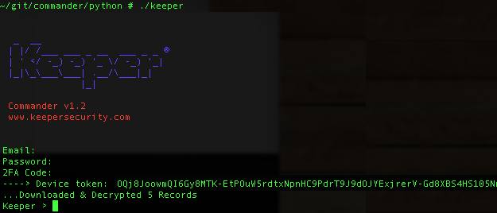
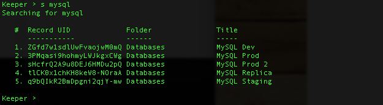
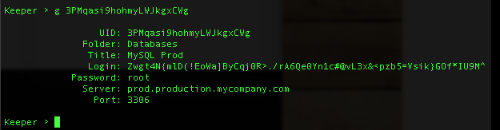

Keeper Commander for Python 3
----

This is the codebase for a Python 3 interface to Keeper.

Here's a preview of what Keeper Commander can do:

#### Logging in  


#### Listing available commands 


#### Searching for records


#### Getting record details 


#### Rotating a password 


The above screenshots are using the terminal version.
You can make the necessary hooks in the Commander source code
to meet your integration needs.

### Installation 

1. Install Python3 from python.org and the below modules:

```
pip3 install requests
pip3 install pycrypto
```

2. Set up a Keeper account from https://keepersecurity.com if you don't 
already have one.

3. Execute command line program as described below or use 
a config.json file to streamline usage.  Command line arguments will 
override the configuration file.

### Command line usage

./keeper

### Optional parameters

./keeper --email=email@company.com 

### Auto-configuration file

For faster access, create a file called config.json and
place the file in your install folder.  Here's an example file:

```
{                                                                               
    "server":"https://dev2.keeperapp.com/v2/",
    "email":"email@company.com",
    "password":"123456",
    "debug":false
}
```

If you don't provide an email or password, you will be prompted
for this information when using Commander.

If you have Two-Factor Authentication enabled on your Keeper account 
(highly recommended), Keeper Commander will prompt you the first time
you login.  After successfully logging in, you will be provided 
a device token. This device token needs to be saved for subsequent
calls. Save this device into your config.json file:

```
{                                                                               
    "server":"https://dev2.keeperapp.com/v2/",
    "email":"email@company.com",
    "password":"123456",
    "mfa_token":"vFcl44TdjQcgTVfCMlUw0O9DIw8mOg8fJypGOlS_Rw0WfXbCD9iw",
    "mfa_type":"device_token",
    "debug":false
}
```

The next time you login, you will be authenticated with the device token.

### Commands

To see a list of supported commands, simply type 'h':

```
Keeper > ?

Commands:

  d         ... download & decrypt data
  l         ... list folders and titles
  s <regex> ... search with regular expression
  g <uid>   ... get record details for uid
  r <uid>   ... rotate password for uid
  c         ... clear the screen
  h         ... show command history
  q         ... quit

```

### Resources 

[Python3 Tutorials](https://docs.python.org/3/index.html)

[Command line parser](https://docs.python.org/3/howto/argparse.html)

[JSON parser](https://docs.python.org/3/library/json.html)

[Requests Module](http://requests.readthedocs.org/en/latest/)

[PYCrypto Module](https://www.dlitz.net/software/pycrypto/api/current/)


