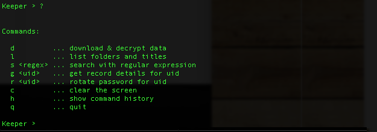

Keeper Commander for Python 3
----

This is the codebase for a Python 3 interface to Keeper.

Here's a preview of what Keeper Commander can do:

#### Logging in  


#### Listing available commands 


#### Searching for records


#### Getting record details 


#### Rotating a password 


The above screenshots are using the terminal version.  You can make the necessary hooks in the Commander source code to meet your integration needs.

### Installation 

1. Install Python3 from python.org and the below modules:

```
sudo pip3 install requests
sudo pip3 install pycrypto
sudo pip3 install PyMySQL
```

2. Set up a Keeper account from https://keepersecurity.com if you don't already have one.

3. Execute command line program as described below or use a config.json file to streamline usage.  Command line arguments will override the configuration file.

### Command line usage

./keeper

### Optional parameters

./keeper --email=email@company.com 

### Auto-configuration file

To automate the use of Commander, create a file called config.json and place the file in your install folder.  If you don't provide a config file, Commander will just prompt you for the information.

Here's an example config.json file:

```
{                                                                               
    "server":"https://keeperapp.com/v2/",
    "email":"your_email_here",
    "password":"your_password_here",
    "debug":false,
    "commands":[]
}
```

You can also tell Commander which config file to use.  By default, we look at the config.json file.  Example:

./keeper --config=foo.json

In this case, Commander will start up using foo.json as the configuration.

### Auto-command execution

You can provide Commander a set of commands to run without having to type them manually.  This is the easiest way to auotomate password resets.

Example:

```
{                                                                               
    "server":"https://keeperapp.com/v2/",
    "email":"admin@company.com",
    "password":"somereallystrongpassword",
    "debug":false,
    "commands":["d", "r 3PMqasi9hohmyLWJkgxCWg", "r tlCK0x1chKH8keW8-NOraA"]
}
```

In this example, we are telling Commander to first download and decrypt records, then reset 2 passwords.  As you can see, each unique password record in the Keeper system is represented by a unique record UID.  Use the "l" or "s" command in Commander's interactive mode to display the record UIDs in your account.

### Two-Factor Authentication and Device Token

If you have Two-Factor Authentication enabled on your Keeper account (highly recommended), Keeper Commander will prompt you for the one-time passcode the first time you login.  After successfully logging in, you will be provided a device token. This device token needs to be saved for subsequent calls. Copy-paste this device token into your config.json file.  For example:

```
{                                                                               
    "server":"https://keeperapp.com/v2/",
    "email":"email@company.com",
    "password":"123456",
    "mfa_token":"vFcl44TdjQcgTVfCMlUw0O9DIw8mOg8fJypGOlS_Rw0WfXbCD9iw",
    "mfa_type":"device_token",
    "debug":false,
    "commands":["r 3PMqasi9hohmyLWJkgxCWg", "r tlCK0x1chKH8keW8-NOraA"]
}
```

### Commands

To see a list of supported commands, simply type 'h':

```
Keeper > ?

Commands:

  d         ... download & decrypt data
  l         ... list folders and titles
  s <regex> ... search with regular expression
  g <uid>   ... get record details for uid
  r <uid>   ... rotate password for uid
  c         ... clear the screen
  h         ... show command history
  q         ... quit

```

### Download Command (d)

This command downloads all 

### List Command (l)

### Search Command (s)

### Get Command (g)

### Rotate Command (r)


### Resources 

[Python3 Tutorials](https://docs.python.org/3/index.html)

[Command line parser](https://docs.python.org/3/howto/argparse.html)

[JSON parser](https://docs.python.org/3/library/json.html)

[Requests Module](http://requests.readthedocs.org/en/latest/)

[PYCrypto Module](https://www.dlitz.net/software/pycrypto/api/current/)


