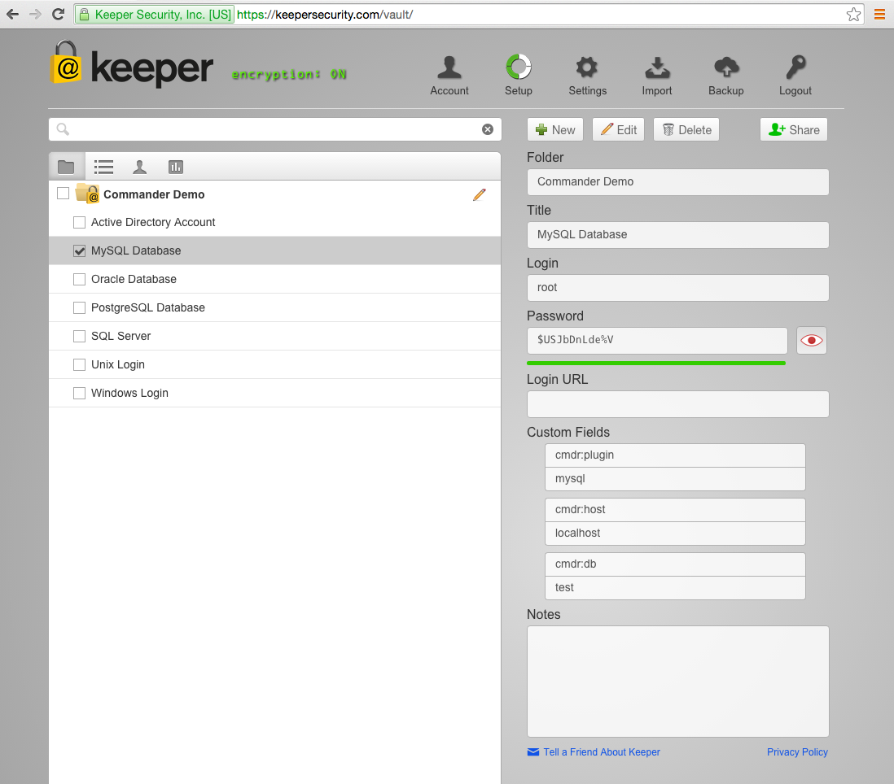

Keeper Commander Plugins
----

Commander's open source plugin architecture provides auto-login and password rotation services into any target platform. Commander can securely rotate passwords in your Keeper vault and then automatically synchronize the change to all users and devices with privileged access to the record. Using our connector plugins, you can then perform the password reset directly on the source (e.g. the database, active directory, etc.).

Using Commander to rotate passwords, combined with the flexibility of Keeper's secure record sharing features provides you with the most secure and flexible way to grant and revoke access to highly sensitive data.

### Supported Plugins

* Active Directory

* Unix Logins

* Windows Logins

* MySQL, Oracle, PostgreSQL, SQL Server

* ... and more to come. 

### Activating a Plugin  

To activate a plugin for a particular Keeper record, you first need to locate the record UID.  This can be found on the command line nterface by using the *list* or *search* command.  For example:


Once you find the record UID, then you can edit the record directly in the [Web App](https://keepersecurity.com/vault) or the [Desktop App](https://keepersecurity.com/download).

Add the fields according to the plugin.  For example, here is a MySQL record:



When a plugin is specified in a record, Commander will search in the plugins/ folder to load the module based on the name provided.  In this case, it will use the mysql.py plugin.

Now on the command line you can use the *download* command to pull down your changes then *get* to view the record info:

At this point, to perform a rotation just use the *rotate* command.  For example in this case:

```
r VEpovl5St-MPcnNrfJkyDg
```

Keeper's team is expanding the number of plugins on an ongoing basis. If you need a particular plugin created, just let us know.
